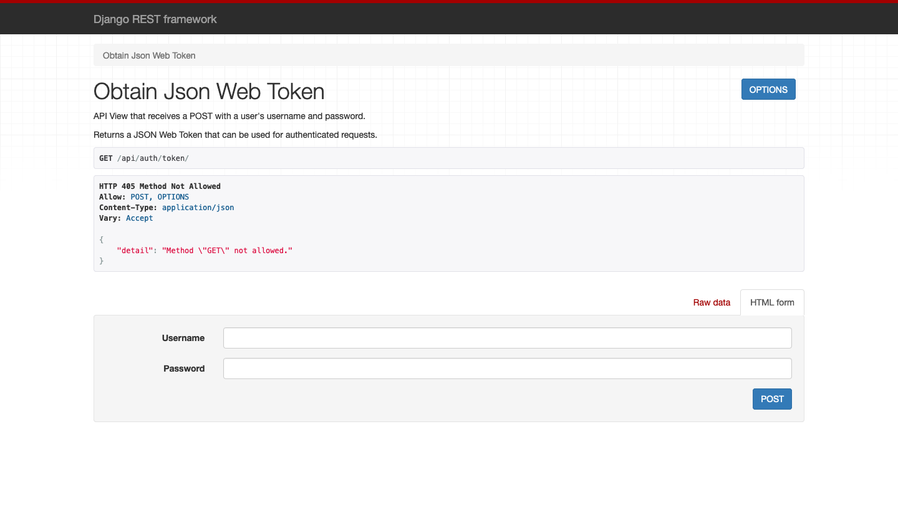

# Challenge Django

# INSTALLING AND RUNNING DJANGO-CHALLENGE APPLICATION


# INSTALLING 

# Virtual Enviroment 

Install virtualenv via pip:
```
$ pip install virtualenv
```


Test your installation:
```
$ virtualenv --version
```

# Basic Usage

-  Create a virtual environment for a project:
```
$ cd django_challenge
$ virtualenv venv
```


- To begin using the virtual environment, it needs to be activated:
```
$ source venv/bin/activate
```

-  Done working in the virtual environment
```
$ deactivate
```

# Installing Packages/Library 

-  Installing Packages / Library for the django_challenge 
```
$ pip install -r requirements.txt
```

This will install all the necessary packages that are used within the Django application 

# Running Django Challenge Application 

-  Run django application with this command 
```
$ python manage.py runserver 
```   

-  Link the to the Django Application inside the browser
```
http://localhost:8000/
http://localhost:8000/api/
```


# List of URLS associated with the Django Application 

```
1:  http://localhost:8000/api/admin/
2:  http://localhost:8000/api/accounts/
3:  http://localhost:8000/api/api/auth/token/
4:  http://localhost:8000/api/api/auth/register/
5:  http://localhost:8000/api/api/auth/token/refresh/ 
6:  http://localhost:8000/api/api-token-verify/
```


Register :
http://localhost:8000/api/auth/register/





**Free Software**

[//]: # (These are reference links used in the body of this note and get stripped out when the markdown processor does its job. There is no need to format nicely because it shouldn't be seen. Thanks SO - http://stackoverflow.com/questions/4823468/store-comments-in-markdown-syntax)